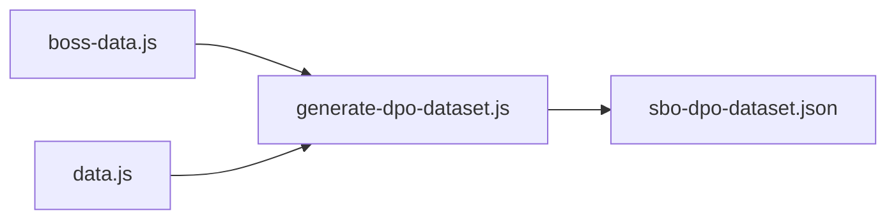

# DPO Dataset Generator from SBO:R Planner Data

## Problem with Hugging Chat's Script

- **boss-data.js is JavaScript, not JSON** — `json.load('boss-data.js')` fails. The file uses `window.SBO_BOSS_DATA = {...}`.
- **Boss data is wrong** — Illfang 20k HP (ok), but Lord Slug 38k not 35k, Stallord 61k not 50k, X'rphan 86k not 75k. Drops are invented (e.g. "Slug Crown" instead of Malachite Ore, Corundum Ore).
- **Stat formulas are wrong** — VIT does not add "+10 HP per point"; it multiplies gear DEX. AGI/LUK formulas are off. Formulas live in [data.js](sbo-rebirth-planner/data.js), not a separate stat-formulas.js.
- **create_variation is weak** — Only appends "exactly?" or "in SBO:R?"; does not add useful diversity.

## Approach

Use a **Node.js script** (same runtime as the planner) to load boss-data and data.js, then emit the DPO dataset. This keeps a single source of truth.




## Implementation

### 1. Create Data Loader

[boss-data.js](sbo-rebirth-planner/boss-data.js) and [data.js](sbo-rebirth-planner/data.js) are browser modules. Load them in Node by reading the file and evaluating the object:

```js
// In generate-dpo-dataset.js
function loadBossData() {
  const code = fs.readFileSync(path.join(__dirname, '../boss-data.js'), 'utf8')
    .replace('window.SBO_BOSS_DATA = ', 'return ');
  return new Function(code + ';')();
}
```

For data.js (formulas only), similarly extract the `SBO_DATA.formulas` object.

### 2. DPO Pair Structure (TRL Format)

Each example:

```json
{
  "prompt": [{"role": "user", "content": "What's the boss of floor 4?"}],
  "chosen": [{"role": "assistant", "content": "Stallord is the boss of Floor 4."}],
  "rejected": [{"role": "assistant", "content": "The boss of Floor 4 is Sanguine Harvester."}]
}
```

### 3. Generation Categories


| Category             | Source                             | Example pairs per boss/stat                       |
| -------------------- | ---------------------------------- | ------------------------------------------------- |
| Boss floor           | boss.floor                         | "What's the boss of floor N?" → exact name        |
| Boss HP              | boss.hp                            | "How much HP does X have?" → exact number         |
| Boss location        | boss.location                      | "Where is X?" → Floor N Boss Room                 |
| Boss drops           | boss.drops, rareDrops, lastHitDrop | "What does X drop?" → real drops                  |
| Boss rec level/skill | boss.recLevel, recSkill            | "What level for X?" → exact recs                  |
| Stat formulas        | data.js formulas                   | STR, DEF, VIT, AGI, LUK — exact formulas          |
| Build advice         | Manual templates                   | Illfang prep, equipment list (concise vs verbose) |


### 4. Rejected-Answer Patterns

Use fixed wrong-answer patterns (from real model mistakes):

- Wrong boss names: "Sanguine Harvester", "Shadow Lord", etc.
- Vague HP: "around 12,000–18,000 HP depending on phase"
- Wrong floor: floor-1 for each boss
- Wrong drops: generic "crafting materials", "varies by luck"
- Verbose stat answers: long explanations instead of formulas
- Unsolicited advice: "I can't see your equipment" + extra recommendations

### 5. File Layout

- **Script:** [scripts/generate-dpo-dataset.js](sbo-rebirth-planner/scripts/generate-dpo-dataset.js)
- **Output:** [scripts/sbo-dpo-dataset.json](sbo-rebirth-planner/scripts/sbo-dpo-dataset.json) (or configurable path)
- **Run:** `node scripts/generate-dpo-dataset.js`

### 6. Target Size

- ~15 floor bosses + ~8 mini bosses → ~60–80 boss-fact pairs
- 5 stats × 3–4 formula questions → ~20 stat pairs
- ~10–15 manual build-advice pairs (concise vs verbose, equipment list)
- **Total: ~100–120 high-quality pairs** (no synthetic duplication)

### 7. Quality Checks

- Chosen answers must match boss-data.js and data.js
- Rejected answers must be plausible mistakes, not random text
- No duplicate prompt+chosen pairs

## Data to Pull (Reference)

From [boss-data.js](sbo-rebirth-planner/boss-data.js): bosses and miniBosses with `name`, `floor`, `hp`, `recLevel`, `recSkill`, `drops`, `rareDrops`, `lastHitDrop`, `location`, `statusEffect`, `phases[].notes`.

From [data.js](sbo-rebirth-planner/data.js): `formulas` (strDamagePerPointPct 0.4, defMultiplierBase 5, vitDexterityMultiplierBase 10, etc.) — map to human-readable stat descriptions from [SBO_SYSTEM_PROMPT](sbo-rebirth-planner/supabase/functions/sbo-ai-advisor/index.ts) (lines 15–30).

## Out of Scope (For Later)

- Integration with DPO training Space (Hugging Chat's responsibility)
- Edge Function switch to Inference Endpoints (separate plan)
- Prompt-injection and equipped-items changes (already in AI improvement plan)

